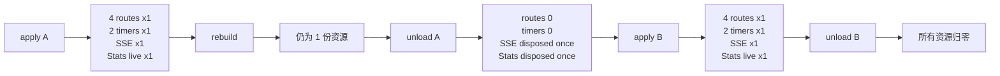

# Host Web 资源逐项去重与下一位 AI 接管报告

- **对象**：本地 `dsh-infinite-gen-5`（Host Web 生命周期演习台）
- **取样时间**：2026-10-09 03:00:17（Asia/Shanghai；证据元数据为 UTC `2026-10-08T19:00:17+00:00`）
- **成功条件**：`apply → rebuild → unload → apply` 中，路由、定时器、SSE 订阅、Stats Service disposer 与监听器数量守恒；卸载后不留存活资源，重复 unload 不重复清理；真实 WebServer HTTP/SSE 请求可复现。

## 本轮改动

1. `scripts/verify_injection_lifecycle.mjs`
   - 演习台捕获 `setInterval/clearInterval`，逐项记录注册、存活、销账和 delay。
   - 捕获 `webServer.register()`，按路径记录路由注册、存活和销账。
   - 捕获 effect 清理函数及清理次数，单独断言 `统计库变更广播（SSE）`。
   - 增加 apply、rebuild、unload、二次 apply 的路由/定时器/SSE/Stats Service 断言。
   - `unload()` 改为幂等：只执行仍 active 的 cleanup，并验证二次 unload 返回 0。
   - `verify_stats_service.mjs` 增加 `service.dispose(); service.dispose();` 与 `disposeCalls === 1` 断言。
2. `services/stats-service.mjs`
   - 增加模块级 Stats Service 生命周期台账：`registered/disposed/live/disposeCalls`。
   - `dispose()` 幂等，同一 Service 只调用底层 store disposer 一次。
   - 新增只读 `statsServiceSnapshot()`，供门禁读取真实台账。
3. `scripts/verify_stats_http.mjs` 与 `package.json`
   - 新增 `npm run verify:stats-http`：用真实 `@deepseek-ai/dsh-host-webserver` 临时 loopback 端口装载真实插件，执行四路由、token、自守、SSE 首帧、Stats 通知帧、unload、二次 apply 请求级验证。
   - 首次请求暴露 `/infinite-gen-5/tasks` 的真实 500：`path.join()` 收到数组参数；修复 `GITHUB_SECRET_FILE()` 为 `joinPath(statsHome(), "infinite-gen-5-github.json")`。

## 生命周期图



## 实测结果（Observed）

### Host Web 生命周期门禁

```text
npm run verify:injection:lifecycle -- --json
LIFECYCLE_SELFTEST_OK
passed=26
failed=0
```

26 条通过包含：

- 四条路由 `/infinite-gen-5/tuning`、`/infinite-gen-5/stats`、`/infinite-gen-5/tasks`、`/infinite-gen-5/events` apply 后各 1 条；
- live timer 与 heartbeat timer apply 后各 1 份；
- Stats SSE 订阅 apply 后 1 份；
- Stats Service apply 后只存活 1 份；
- rebuild 不产生 2N 路由或定时器；
- unload 后四条路由全部销账；
- unload 后两个定时器全部停止；
- unload 后 SSE cleanup 恰好执行 1 次；
- unload 后 Stats disposer 恰好执行 1 次；
- 重复 unload 不重复执行 disposer；
- 二次 apply 恢复为 N，而不是 2N。

### 真实 HTTP/SSE 请求级门禁

```text
npm run verify:stats-http -- --json
passed=24
failed=0
```

24 条通过覆盖：

- 真实 `dsh-host-webserver` loopback 临时端口监听；
- 四条精确路由集合完全一致；
- index injection token 存在；
- `/tuning`、`/stats`、`/tasks` 带 header token 均 200 + `ok:true`；
- 非 SSE 路由拒绝 query token、缺 header 返回 401；
- SSE query token 200、`text/event-stream`、`no-store`、`retry + hello` 首帧；
- Stats 强制落盘后收到 `stats` 通知帧；错误 SSE token 返回 401；
- 第一次真实 unload 清除四路由并销账一次；
- 第二次 apply 恢复四路由并重新注入 token，`/stats` 仍可读。

### 既有回归门禁

```text
verify_stats_service: PASS schema=ig5-stats/1 notifications=1 lifecycle=apply-dispose-apply upgrade=ok failure-isolated
无限五代 统计库与面板自检：120 通过 / 0 失败
verify_stats_alias_gate: PASS scanned=242 allowed=service/store/compat-tests
boot_attest 门禁通过（共 17 条）
```

JavaScript 语法检查通过：

```text
node --check index.js
node --check services/stats-service.mjs
node --check scripts/verify_stats_service.mjs
node --check scripts/verify_injection_lifecycle.mjs
node --check scripts/verify_stats_http.mjs
```

## 证据文件

- `evidence/verify_stats_http.baseline.txt`：真实 HTTP/SSE 请求级门禁，24/0。
- `evidence/verify_stats_http.stderr.txt`：HTTP/SSE 门禁 stderr（空）。
- `evidence/verify_stats_http.status`：请求级门禁 exit=0。
- `evidence/verify_stats_http.initial-tasks-500.txt`：首次请求级运行暴露的 `/tasks` 500 失败与根因记录。
- `evidence/verify_injection_lifecycle.baseline.txt`：生命周期 JSON 基线，26/0。
- `evidence/verify_injection_lifecycle.stderr.txt`：三条既有 Host identity 残留提示。
- `evidence/verify_stats_service.baseline.txt`：Stats Service PASS。
- `evidence/verify_stats_panel.baseline.txt`：Panel 120/0。
- `evidence/verify_stats_alias_gate.baseline.txt`：Alias Gate PASS，scanned=242。
- `evidence/verify_boot.baseline.txt`：Boot 17 条通过。
- `evidence/host-resource-dedupe.baseline.meta`：取样时间元数据。

## Host identity 残留提示

`evidence/verify_injection_lifecycle.stderr.txt` 中出现 3 次：

```text
[infinite-gen-5] 接管残留检查：仍命中宿主立场句 host-identity×1（接管未干净）
```

这是 Host identity 接管残留检查输出，不属于 Stats Service 写盘、HTTP 路由、SSE、定时器或 disposer 失败；生命周期 JSON 仍为 `passed=26 / failed=0`。

## 下一位 AI 首轮复验

```bash
cd /root/Documents/deepseek-harness/default-workspace/dsh-infinite-gen-5-v2/dsh-infinite-gen-5
npm run verify:stats-http -- --json
npm run verify:stats-alias-gate
npm run verify:stats-service
npm run verify:stats-panel
npm run verify:boot
npm run verify:injection:lifecycle -- --json
node --check index.js
node --check services/stats-service.mjs
node --check scripts/verify_stats_service.mjs
node --check scripts/verify_injection_lifecycle.mjs
node --check scripts/verify_stats_http.mjs
```

## 状态标签

已知：Host 演习台生命周期门禁 26/0；真实 `dsh-host-webserver` 临时 loopback 请求级门禁 24/0；四路由、token 自守、SSE 首帧/通知帧、真实 unload 与二次 apply 均实测通过；首次 `/tasks` 500 已由请求级证据定位并修复。

推测：重复 Host apply/rebuild 的资源泄漏面在演习台与临时真实 WebServer 两层均已覆盖；真实 GUI 进程仍需以实际宿主停用调度为最终依据。

未知：当前 GUI 进程跨重启期间的 HTTP/EventSource 连接计数与浏览器端连接复用尚未单独取样；临时 WebServer 门禁不等价于生产 GUI 的跨进程计数。

过期：此前 `passed=10 / failed=0` 与随后 `passed=20 / failed=0` 的旧生命周期基线（有效期到 2026 年 10 月 9 日，依据本轮新增二次 apply 资源断言替代）；替代基线为 `passed=26 / failed=0`。

截至 2026 年 10 月 9 日 已验证
适用范围：本地 `dsh-infinite-gen-5` Host Web 生命周期演习台、临时真实 `dsh-host-webserver` HTTP/SSE、Stats Service、面板、Alias、Boot 回归链
已知推测未知：26 条演习台断言与 24 条真实 HTTP/SSE 请求级断言均通过；当前 GUI 跨进程连接复用仍未知
依赖与边界：兼容别名 `set/bump/push/onChange` 保持；`/tasks` 的 `path.join` 修复已通过请求级回归；Host identity 残留提示单独记录，不并入 Stats 失败
